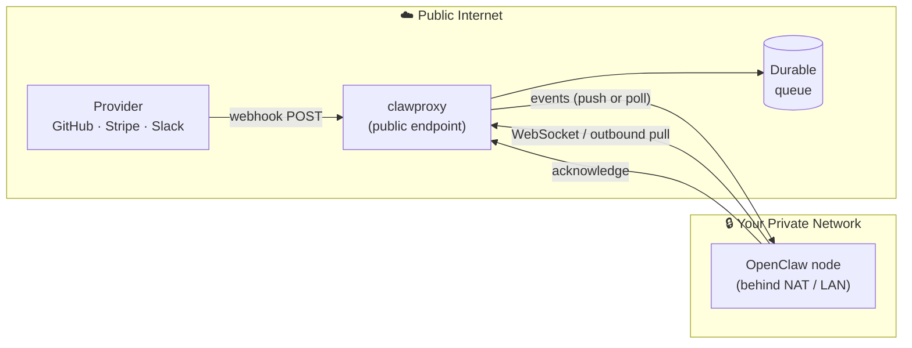

# clawproxy

A lightweight, self-hostable Next.js service that provides secure public webhook ingress and queued event delivery for private OpenClaw nodes that can only communicate outbound.

See [PLAN.md](./PLAN.md) for the full product specification and architectural decisions.

## How it works

Private OpenClaw nodes connect to clawproxy in one of two ways:

**WebSocket (live push — recommended):** The node opens a persistent WebSocket connection to `/api/nodes/ws`. Events are pushed to the node in real-time the moment they arrive, with no polling delay.

**HTTP polling (fallback):** The node periodically calls `POST /api/nodes/pull` to fetch queued events. Useful when WebSocket connections are not available.

Both modes use the same lease/acknowledge delivery guarantee.



1. **A provider** (GitHub, Stripe, Slack, …) sends a webhook to your public clawproxy URL.
2. **clawproxy** accepts the request, validates it, and persists the event to a durable queue.
3. **Your OpenClaw node** — running behind NAT or a private LAN — connects to clawproxy over an outbound connection, receives queued events, processes them locally, and acknowledges delivery.

Your private node never needs an open port or firewall rule.

## WebSocket Protocol

Nodes connect to `wss://<your-clawproxy-host>/api/nodes/ws` and authenticate immediately after the connection is established.

**Node → clawproxy:**

| Message | Description |
|---|---|
| `{ "type": "auth", "token": "cpn_..." }` | Authenticate with the node bearer token |
| `{ "type": "ack", "eventIds": ["uuid", ...] }` | Acknowledge one or more delivered events |

**clawproxy → node:**

| Message | Description |
|---|---|
| `{ "type": "auth_ok", "nodeId": "uuid" }` | Authentication succeeded |
| `{ "type": "auth_error", "error": "..." }` | Authentication failed |
| `{ "type": "event", "id": "...", "routeSlug": "...", "body": "...", ... }` | An event ready to process |
| `{ "type": "ack_ok", "acked": 2, "eventIds": [...] }` | Acknowledge confirmed |
| `{ "type": "ack_error", "error": "..." }` | Acknowledge validation failed |

**Connection lifecycle:**
1. Open `wss://…/api/nodes/ws`
2. Send `{ "type": "auth", "token": "cpn_…" }` within 10 seconds
3. Receive `auth_ok` — any pending events are flushed immediately
4. Receive `event` messages in real-time; send `ack` for each batch processed
5. Reconnect on close (the pull-based HTTP endpoints remain available as a fallback)

## Getting Started

### Prerequisites

- Node.js 22+
- A [Neon](https://neon.tech) Postgres database
- A [Neon Auth](https://neon.tech/docs/guides/neon-auth) project

### Environment variables

| Variable | Required | Description |
|---|---|---|
| `DATABASE_URL` | Yes | Neon Postgres connection string |
| `NEON_AUTH_BASE_URL` | Yes | Neon Auth base URL (server-side) |
| `NEON_AUTH_COOKIE_SECRET` | Yes | Secret used to sign session cookies (min 32 chars) |
| `NEXT_PUBLIC_NEON_AUTH_BASE_URL` | Yes | Neon Auth base URL (embedded in the client bundle at build time) |
| `ENCRYPTION_KEY` | Yes | 64-character hex string (32 bytes) used for AES-256-GCM encryption of sensitive fields at rest. Generate with: `node -e "console.log(require('crypto').randomBytes(32).toString('hex'))"` |

Copy `.env.example` (if present) to `.env.local` and fill in the values before running locally.

### Encryption at rest

The following fields are encrypted with AES-256-GCM before being written to the database and decrypted on read. The key is read from the `ENCRYPTION_KEY` environment variable.

| Table | Column | Type | Description |
|---|---|---|---|
| `events` | `headers_json` | text (was jsonb) | Incoming HTTP request headers |
| `events` | `body_text` | text | Raw webhook request body |
| `nodes` | `name` | text | User-defined node display name |

Ciphertext is stored as `v1:<iv_base64>:<authtag_base64>:<ciphertext_base64>`. Each value uses a unique random 12-byte IV, so identical plaintexts produce distinct ciphertexts.

**Rotating the encryption key** requires re-encrypting all stored values. Decrypt each row with the old key and re-encrypt with the new key before updating `ENCRYPTION_KEY` in production.

**Migrating existing unencrypted data** (if the table was populated before encryption was enabled): the `headers_json` column type was changed from `jsonb` to `text` in migration `0001`. Existing rows will contain plaintext JSON or `jsonb`-cast text. Re-encrypt them with the data migration script before serving live traffic.

### Local development

Enable Corepack once (ships with Node 22) so the pinned Yarn version from `packageManager` is used:

```bash
corepack enable
yarn install
yarn dev
```

Open [http://localhost:3000](http://localhost:3000).

To develop with WebSocket support enabled, use the custom server instead:

```bash
yarn dev:ws
```

This starts the HTTP+WebSocket server (`server.ts`) directly via `tsx` and also serves the Next.js app on port 3000. Connect nodes to `ws://localhost:3000/api/nodes/ws`.

### Database

```bash
yarn db:generate   # generate migrations from schema changes
yarn db:migrate    # apply migrations to the database
```

## Deployment

### Docker

The project ships with a multi-stage `Dockerfile` that produces a minimal production image using [Next.js standalone output](https://nextjs.org/docs/app/api-reference/next-config-js/output#automatically-copying-needed-files).

**Build the image**

`NEXT_PUBLIC_NEON_AUTH_BASE_URL` is baked into the client bundle at build time, so it must be passed as a build argument:

```bash
docker build \
  --build-arg NEXT_PUBLIC_NEON_AUTH_BASE_URL=https://<your-neon-auth-url> \
  -t clawproxy .
```

**Run the container**

Pass runtime secrets as environment variables:

```bash
docker run -p 3000:3000 \
  -e DATABASE_URL="postgresql://..." \
  -e NEON_AUTH_BASE_URL="https://..." \
  -e NEON_AUTH_COOKIE_SECRET="..." \
  clawproxy
```

The app listens on port `3000` by default. Override with `-e PORT=<port>`.

### Nixpacks

The project includes a `nixpacks.toml` that configures the build for [Nixpacks-compatible platforms](https://nixpacks.com) (e.g. Railway, Render).

Set the following environment variables in your platform's dashboard before deploying:

| Variable | Notes |
|---|---|
| `DATABASE_URL` | Neon Postgres connection string |
| `NEON_AUTH_BASE_URL` | Neon Auth base URL |
| `NEON_AUTH_COOKIE_SECRET` | Session cookie signing secret |
| `NEXT_PUBLIC_NEON_AUTH_BASE_URL` | Must be set **before** the build runs so it is inlined into the client bundle |

Deploy with the Nixpacks CLI:

```bash
nixpacks build . --name clawproxy
nixpacks run clawproxy
```

Or push to a connected platform (Railway, Render, etc.) and it will detect the `nixpacks.toml` automatically.

## Scripts

| Script | Description |
|---|---|
| `yarn dev` | Start Next.js development server (HTTP only) |
| `yarn dev:ws` | Start custom HTTP+WebSocket development server |
| `yarn build` | Build for production (bundles WebSocket server into standalone output) |
| `yarn start` | Start production server |
| `yarn lint` | Run ESLint |
| `yarn test` | Run tests in watch mode |
| `yarn test:run` | Run tests once |
| `yarn test:coverage` | Run tests with V8 coverage report (`coverage/`) |
| `yarn db:generate` | Generate Drizzle migrations |
| `yarn db:migrate` | Apply Drizzle migrations |
| `yarn db:push` | Push schema to DB (dev only) |

